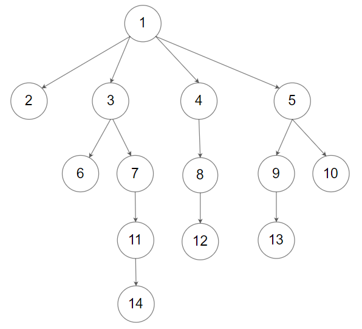

# [LeetCode][leetcode] task # 589: [N-ary Tree Preorder Traversal][task]

Description
-----------

> Given the `root` of an n-ary tree, return _the preorder traversal of its nodes' values_.
> 
> Nary-Tree input serialization is represented in their level order traversal.
> Each group of children is separated by the null value (See examples)

 Example
-------



```sh
Input: root = [1,null,2,3,4,5,null,null,6,7,null,8,null,9,10,null,null,11,null,12,null,13,null,null,14]
Output: [1,2,3,6,7,11,14,4,8,12,5,9,13,10]
```

Solution
--------

| Task | Solution                                  |
|:----:|:------------------------------------------|
| 589  | [N-ary Tree Preorder Traversal][solution] |


[leetcode]: <http://leetcode.com/>
[task]: <https://leetcode.com/problems/n-ary-tree-preorder-traversal/>
[solution]: <https://github.com/wellaxis/witalis-jkit/blob/main/module/tasks/src/main/java/com/witalis/jkit/tasks/core/task/leetcode/h6/p589/option/Practice.java>
