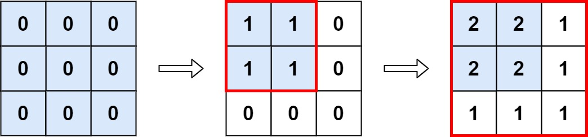

# [LeetCode][leetcode] task # 598: [Range Addition II][task]

Description
-----------

> You are given an `m x n` matrix `M` initialized with all `0`'s and an array of operations `ops`,
> where `ops[i] = [ai, bi]` means `M[x][y]` should be incremented by one for all `0 <= x < ai` and `0 <= y < bi`.
> 
> Count and return _the number of maximum integers in the matrix after performing all the operations_.

 Example
-------



```sh
Input: m = 3, n = 3, ops = [[2,2],[3,3]]
Output: 4
Explanation: The maximum integer in M is 2, and there are four of it in M. So return 4.
```

Solution
--------

| Task | Solution                      |
|:----:|:------------------------------|
| 598  | [Range Addition II][solution] |


[leetcode]: <http://leetcode.com/>
[task]: <https://leetcode.com/problems/range-addition-ii/>
[solution]: <https://github.com/wellaxis/praxis-leetcode/blob/main/src/main/java/com/witalis/praxis/leetcode/task/h6/p598/option/Practice.java>
