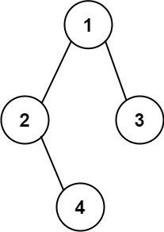

# [LeetCode][leetcode] task # 606: [Construct String from Binary Tree][task]

Description
-----------

> Given the `root` of a binary tree, construct a string consisting of parenthesis
> and integers from a binary tree with the preorder traversal way, and return it.
> 
> Omit all the empty parenthesis pairs that do not affect the one-to-one mapping
> relationship between the string and the original binary tree.

 Example
-------



```sh
Input: root = [1,2,3,null,4]
Output: "1(2()(4))(3)"
Explanation: Almost the same as the first example, except we cannot omit the first parenthesis pair
    to break the one-to-one mapping relationship between the input and the output.
```

Solution
--------

| Task | Solution                                      |
|:----:|:----------------------------------------------|
| 606  | [Construct String from Binary Tree][solution] |


[leetcode]: <http://leetcode.com/>
[task]: <https://leetcode.com/problems/construct-string-from-binary-tree/>
[solution]: <https://github.com/wellaxis/praxis-leetcode/blob/main/src/main/java/com/witalis/praxis/leetcode/task/h7/p606/option/Practice.java>
