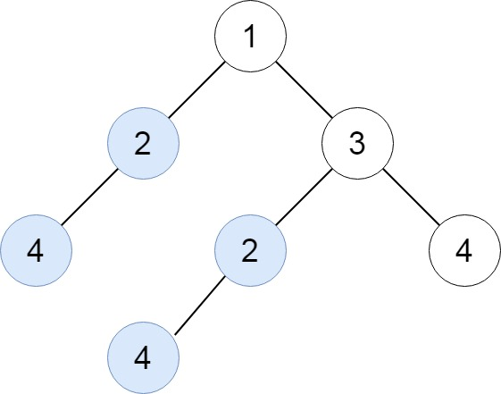

# [LeetCode][leetcode] task # 652: [Find Duplicate Subtrees][task]

Description
-----------

> Given the `root` of a binary tree, return all **duplicate subtrees**.
> 
> For each kind of duplicate subtrees, you only need to return the root node of any **one** of them.
> 
> Two trees are **duplicate** if they have the **same structure** with the **same node values**.

 Example
-------



```sh
Input: root = [1,2,3,4,null,2,4,null,null,4]
Output: [[2,4],[4]]
```

Solution
--------

| Task | Solution                            |
|:----:|:------------------------------------|
| 652  | [Find Duplicate Subtrees][solution] |


[leetcode]: <http://leetcode.com/>
[task]: <https://leetcode.com/problems/find-duplicate-subtrees/>
[solution]: <https://github.com/wellaxis/praxis-leetcode/blob/main/src/main/java/com/witalis/praxis/leetcode/task/h7/p652/option/Practice.java>
