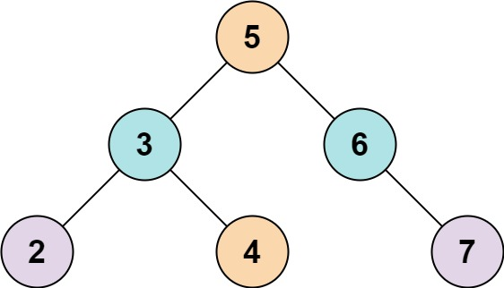

# [LeetCode][leetcode] task # 653: [Two Sum IV - Input is a BST][task]

Description
-----------

> Given the `root` of a Binary Search Tree and a target number `k`,
> return _`true` if there exist two elements in the BST such that their sum is equal to the given target_.

 Example
-------



```sh
Input: root = [5,3,6,2,4,null,7], k = 9
Output: true
```

Solution
--------

| Task | Solution                                |
|:----:|:----------------------------------------|
| 653  | [Two Sum IV - Input is a BST][solution] |


[leetcode]: <http://leetcode.com/>
[task]: <https://leetcode.com/problems/two-sum-iv-input-is-a-bst/>
[solution]: <https://github.com/wellaxis/praxis-leetcode/blob/main/src/main/java/com/witalis/praxis/leetcode/task/h7/p653/option/Practice.java>
