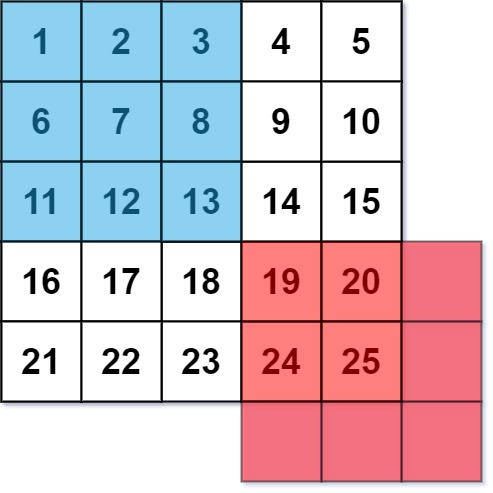
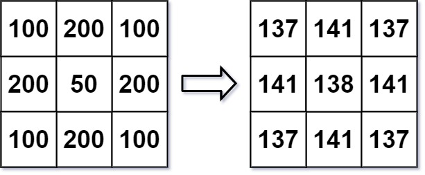

# [LeetCode][leetcode] task # 661: [Image Smoother][task]

Description
-----------

> An **image smoother** is a filter of the size `3 x 3` that can be applied to each cell
> of an image by rounding down the average of the cell and the eight surrounding cells
> (i.e., the average of the nine cells in the blue smoother).
> If one or more of the surrounding cells of a cell is not present,
> we do not consider it in the average (i.e., the average of the four cells in the red smoother).



> Given an `m x n` integer matrix `img` representing the grayscale of an image,
> return _the image after applying the smoother on each cell of it_.
 
 Example
-------



```sh
Input: img = [[100,200,100],[200,50,200],[100,200,100]]
Output: [[137,141,137],[141,138,141],[137,141,137]]
Explanation:
    For the points (0,0), (0,2), (2,0), (2,2):
        floor((100+200+200+50)/4) = floor(137.5) = 137
    For the points (0,1), (1,0), (1,2), (2,1):
        floor((200+200+50+200+100+100)/6) = floor(141.666667) = 141
    For the point (1,1):
        floor((50+200+200+200+200+100+100+100+100)/9) = floor(138.888889) = 138
```

Solution
--------

| Task | Solution                   |
|:----:|:---------------------------|
| 661  | [Image Smoother][solution] |


[leetcode]: <http://leetcode.com/>
[task]: <https://leetcode.com/problems/base-7/>
[solution]: <https://github.com/wellaxis/witalis-jkit/blob/main/module/tasks/src/main/java/com/witalis/jkit/tasks/core/task/leetcode/h7/p661/option/Practice.java>
