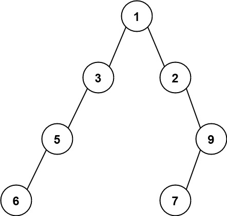

# [LeetCode][leetcode] task # 662: [Maximum Width of Binary Tree][task]

Description
-----------

> Given the `root` of a binary tree, return _the **maximum width** of the given tree_.
> 
> The **maximum width** of a tree is the maximum **width** among all levels.
> 
> The **width** of one level is defined as the length between the end-nodes (the leftmost and rightmost non-null nodes),
> where the null nodes between the end-nodes that would be present in a complete binary tree
> extending down to that level are also counted into the length calculation.
> 
> It is **guaranteed** that the answer will in the range of a **32-bit** signed integer.

 Example
-------



```sh
Input: root = [1,3,2,5,null,null,9,6,null,7]
Output: 7
Explanation: The maximum width exists in the fourth level with length 7 (6,null,null,null,null,null,7).
```

Solution
--------

| Task | Solution                                 |
|:----:|:-----------------------------------------|
| 662  | [Maximum Width of Binary Tree][solution] |


[leetcode]: <http://leetcode.com/>
[task]: <https://leetcode.com/problems/maximum-width-of-binary-tree/>
[solution]: <https://github.com/wellaxis/praxis-leetcode/blob/main/src/main/java/com/witalis/praxis/leetcode/task/h7/p662/option/Practice.java>
