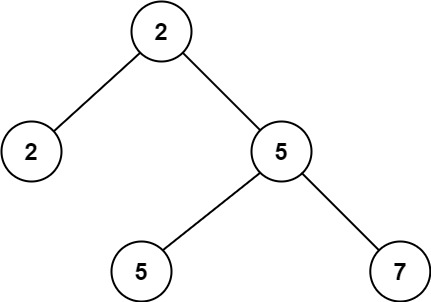

# [LeetCode][leetcode] task # 671: [Second Minimum Node In a Binary Tree][task]

Description
-----------

> Given a non-empty special binary tree consisting of nodes with the non-negative value,
> where each node in this tree has exactly `two` or `zero` sub-node.
> If the node has two sub-nodes, then this node's value is the smaller value among its two sub-nodes.
> More formally, the property `root.val = min(root.left.val, root.right.val)` always holds.
> 
> Given such a binary tree, you need to output the **second minimum** value
> in the set made of all the nodes' value in the whole tree.
> 
> If no such second minimum value exists, output `-1` instead.

 Example
-------



```sh
Input: root = [2,2,5,null,null,5,7]
Output: 5
Explanation: The smallest value is 2, the second smallest value is 5.
```

Solution
--------

| Task | Solution                                         |
|:----:|:-------------------------------------------------|
| 671  | [Second Minimum Node In a Binary Tree][solution] |


[leetcode]: <http://leetcode.com/>
[task]: <https://leetcode.com/problems/second-minimum-node-in-a-binary-tree/>
[solution]: <https://github.com/wellaxis/witalis-jkit/blob/main/module/tasks/src/main/java/com/witalis/jkit/tasks/core/task/leetcode/h7/p671/option/Practice.java>
