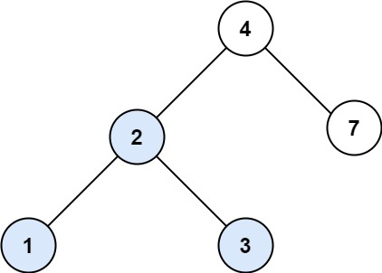

# [LeetCode][leetcode] task # 700: [Search in a Binary Search Tree][task]

Description
-----------

> You are given the `root` of a binary search tree (BST) and an integer `val`.
> 
> Find the node in the BST that the node's value equals `val` and
> return the subtree rooted with that node. If such a node does not exist, return `null`.

 Example
-------



```sh
Input: root = [4,2,7,1,3], val = 2
Output: [2,1,3]
```

Solution
--------

| Task | Solution                                   |
|:----:|:-------------------------------------------|
| 700  | [Search in a Binary Search Tree][solution] |


[leetcode]: <http://leetcode.com/>
[task]: <https://leetcode.com/problems/search-in-a-binary-search-tree/>
[solution]: <https://github.com/wellaxis/witalis-jkit/blob/main/module/tasks/src/main/java/com/witalis/jkit/tasks/core/task/leetcode/h8/p700/option/Practice.java>
