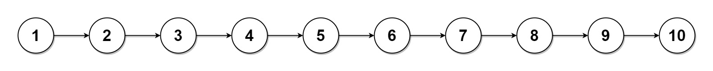

# [LeetCode][leetcode] task # 725: [Split Linked List in Parts][task]

Description
-----------

> Given the `head` of a singly linked list and an integer `k`,
> split the linked list into `k` consecutive linked list parts.
> 
> The length of each part should be as equal as possible: no two parts should have a size differing by more than one.
> This may lead to some parts being `null`.
> 
> The parts should be in the order of occurrence in the input list,
> and parts occurring earlier should always have a size greater than or equal to parts occurring later.
> 
> Return _an array of the `k` parts_.



Example
-------

```sh
Input: head = [1,2,3,4,5,6,7,8,9,10], k = 3
Output: [[1,2,3,4],[5,6,7],[8,9,10]]
Explanation:
    The input has been split into consecutive parts with size difference at most 1, and earlier parts are a larger size than the later parts.
```

Solution
--------

| Task | Solution                               |
|:----:|:---------------------------------------|
| 725  | [Split Linked List in Parts][solution] |


[leetcode]: <http://leetcode.com/>
[task]: <https://leetcode.com/problems/split-linked-list-in-parts/>
[solution]: <https://github.com/wellaxis/praxis-leetcode/blob/main/src/main/java/com/witalis/praxis/leetcode/task/h8/p725/option/Practice.java>
