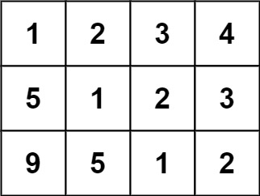

# [LeetCode][leetcode] task # 766: [Toeplitz Matrix][task]

Description
-----------

> Given an `m x n` `matrix`, return _`true` if the matrix is Toeplitz. Otherwise, return `false`_.
> 
> A matrix is **Toeplitz** if every diagonal from top-left to bottom-right has the same elements.

 Example
-------



```sh
Input: matrix = [[1,2,3,4],[5,1,2,3],[9,5,1,2]]
Output: true
Explanation:
    In the above grid, the diagonals are:
    "[9]", "[5, 5]", "[1, 1, 1]", "[2, 2, 2]", "[3, 3]", "[4]".
    In each diagonal all elements are the same, so the answer is True.
```

Solution
--------

| Task | Solution                    |
|:----:|:----------------------------|
| 766  | [Toeplitz Matrix][solution] |


[leetcode]: <http://leetcode.com/>
[task]: <https://leetcode.com/problems/toeplitz-matrix/>
[solution]: <https://github.com/wellaxis/praxis-leetcode/blob/main/src/main/java/com/witalis/praxis/leetcode/task/h8/p766/option/Practice.java>
