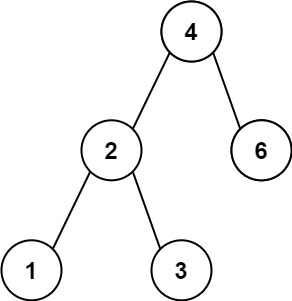

# [LeetCode][leetcode] task # 783: [Minimum Distance Between BST Nodes][task]

Description
-----------

> Given the `root` of a Binary Search Tree (BST),
> return _the minimum difference between the values of any two different nodes in the tree_.

 Example
-------



```sh
Input: root = [4,2,6,1,3]
Output: 1
```

Solution
--------

| Task | Solution                                       |
|:----:|:-----------------------------------------------|
| 783  | [Minimum Distance Between BST Nodes][solution] |


[leetcode]: <http://leetcode.com/>
[task]: <https://leetcode.com/problems/minimum-distance-between-bst-nodes/>
[solution]: <https://github.com/wellaxis/praxis-leetcode/blob/main/src/main/java/com/witalis/praxis/leetcode/task/h8/p783/option/Practice.java>
