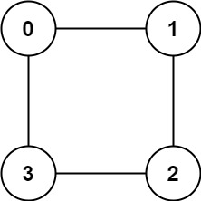

# [LeetCode][leetcode] task # 785: [Is Graph Bipartite?][task]

Description
-----------

> There is an **undirected** graph with `n` nodes, where each node is numbered between `0` and `n - 1`.
> You are given a 2D array `graph`, where `graph[u]` is an array of nodes that node `u` is adjacent to.
> More formally, for each `v` in `graph[u]`, there is an undirected edge between node `u` and node `v`.
> 
> The graph has the following properties:
> * There are no self-edges (`graph[u]` does not contain `u`).
> * There are no parallel edges (`graph[u]` does not contain duplicate values).
> * If `v` is in `graph[u]`, then `u` is in `graph[v]` (the graph is undirected).
> * The graph may not be connected, meaning there may be two nodes `u` and `v` such that there is no path between them.
>
> A graph is **bipartite** if the nodes can be partitioned into two independent sets `A` and `B` such that
> **every** edge in the graph connects a node in set `A` and a node in set `B`.
> 
> Return _`true` if and only if it is **bipartite**_.

 Example
-------



```sh
Input: graph = [[1,3],[0,2],[1,3],[0,2]]
Output: true
Explanation: We can partition the nodes into two sets: {0, 2} and {1, 3}.
```

Solution
--------

| Task | Solution                        |
|:----:|:--------------------------------|
| 785  | [Is Graph Bipartite?][solution] |


[leetcode]: <http://leetcode.com/>
[task]: <https://leetcode.com/problems/is-graph-bipartite/>
[solution]: <https://github.com/wellaxis/praxis-leetcode/blob/main/src/main/java/com/witalis/praxis/leetcode/task/h8/p785/option/Practice.java>
