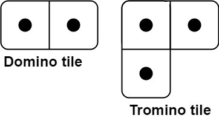
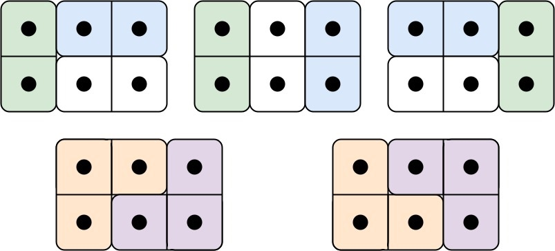

# [LeetCode][leetcode] task # 790: [Domino and Tromino Tiling][task]

Description
-----------

> You have two types of tiles: a `2 x 1` domino shape and a tromino shape.
> You may rotate these shapes.
> 
> 
> 
> Given an integer `n`, return _the number of ways to tile an `2 x n` board_.
> Since the answer may be very large, return it **modulo** `10^9 + 7`.
> 
> In a tiling, every square must be covered by a tile.
> Two tilings are different if and only if there are two 4-directionally adjacent cells on the board
> such that exactly one of the tilings has both squares occupied by a tile.

Example
-------



```sh
Input: n = 3
Output: 5
Explanation: The five different ways are show above.
```

Solution
--------

| Task | Solution                              |
|:----:|:--------------------------------------|
| 790  | [Domino and Tromino Tiling][solution] |


[leetcode]: <http://leetcode.com/>
[task]: <https://leetcode.com/problems/domino-and-tromino-tiling/>
[solution]: <https://github.com/wellaxis/praxis-leetcode/blob/main/src/main/java/com/witalis/praxis/leetcode/task/h8/p790/option/Practice.java>
