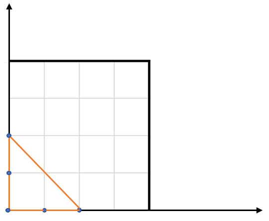

# [LeetCode][leetcode] task # 812: [Largest Triangle Area][task]

Description
-----------

> Given an array of points on the **X-Y** plane `points` where `points[i] = [xi, yi]`,
> return _the area of the largest triangle that can be formed by any three different points_.
> Answers within `10^-5` of the actual answer will be accepted.

 Example
-------



```sh
Input: points = [[0,0],[0,1],[1,0],[0,2],[2,0]]
Output: 2.00000
Explanation: The five points are shown in the above figure. The red triangle is the largest.
```

Solution
--------

| Task | Solution                          |
|:----:|:----------------------------------|
| 812  | [Largest Triangle Area][solution] |


[leetcode]: <http://leetcode.com/>
[task]: <https://leetcode.com/problems/largest-triangle-area/>
[solution]: <https://github.com/wellaxis/praxis-leetcode/blob/main/src/main/java/com/witalis/praxis/leetcode/task/h9/p812/option/Practice.java>
