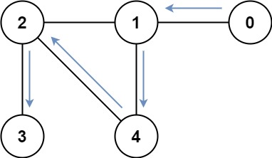

# [LeetCode][leetcode] task # 847: [Shortest Path Visiting All Nodes][task]

Description
-----------

> You have an undirected, connected graph of `n` nodes labeled from `0` to `n - 1`.
> You are given an array `graph` where `graph[i]` is a list of all the nodes connected with node `i` by an edge.
> 
> Return _the length of the shortest path that visits every node_.
> You may start and stop at any node, you may revisit nodes multiple times, and you may reuse edges.

 Example
-------



```sh
Input: graph = [[1],[0,2,4],[1,3,4],[2],[1,2]]
Output: 4
Explanation: One possible path is [0,1,4,2,3]
```

Solution
--------

| Task | Solution                                     |
|:----:|:---------------------------------------------|
| 847  | [Shortest Path Visiting All Nodes][solution] |


[leetcode]: <http://leetcode.com/>
[task]: <https://leetcode.com/problems/shortest-path-visiting-all-nodes/>
[solution]: <https://github.com/wellaxis/praxis-leetcode/blob/main/src/main/java/com/witalis/praxis/leetcode/task/h9/p847/option/Practice.java>
