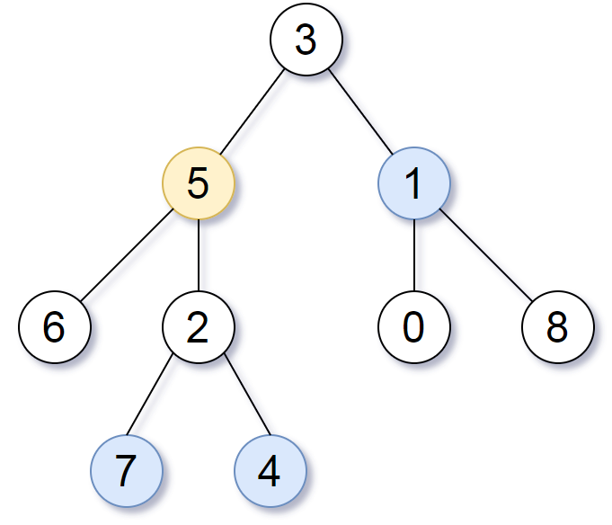

# [LeetCode][leetcode] task # 863: [All Nodes Distance K in Binary Tree][task]

Description
-----------

> Given the `root` of a binary tree, the value of a target node `target`, and an integer `k`,
> return _an array of the values of all nodes that have a distance `k` from the target node_.
> 
> You can return the answer in **any order**.

 Example
-------



```sh
Input: root = [3,5,1,6,2,0,8,null,null,7,4], target = 5, k = 2
Output: [7,4,1]
Explanation: The nodes that are a distance 2 from the target node (with value 5) have values 7, 4, and 1.
```

Solution
--------

| Task | Solution                                        |
|:----:|:------------------------------------------------|
| 863  | [All Nodes Distance K in Binary Tree][solution] |


[leetcode]: <http://leetcode.com/>
[task]: <https://leetcode.com/problems/all-nodes-distance-k-in-binary-tree/description/>
[solution]: <https://github.com/wellaxis/praxis-leetcode/blob/main/src/main/java/com/witalis/praxis/leetcode/task/h9/p863/option/Practice.java>
