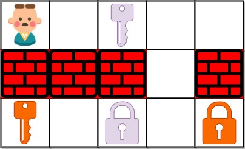

# [LeetCode][leetcode] task # 864: [Shortest Path to Get All Keys][task]

Description
-----------

> You are given an `m x n` grid `grid` where:
> * `'.'` is an empty cell.
> * `'#'` is a wall.
> * `'@'` is the starting point.
> * Lowercase letters represent keys.
> * Uppercase letters represent locks.
>
> You start at the starting point and one move consists of walking one space in one of the four cardinal directions.
> You cannot walk outside the grid, or walk into a wall.
> 
> If you walk over a key, you can pick it up, and you cannot walk over a lock unless you have its corresponding key.
> 
> For some `1 <= k <= 6`, there is exactly one lowercase and one uppercase letter
> of the first `k` letters of the English alphabet in the grid.
> This means that there is exactly one key for each lock, and one lock for each key;
> and also that the letters used to represent the keys and locks were chosen in the same order as the English alphabet.
> 
> Return _the lowest number of moves to acquire all keys_. If it is impossible, return `-1`.

Example
-------



```sh
Input: grid = ["@.a..","###.#","b.A.B"]
Output: 8
Explanation: Note that the goal is to obtain all the keys not to open all the locks.
```

Solution
--------

| Task | Solution                                  |
|:----:|:------------------------------------------|
| 864  | [Shortest Path to Get All Keys][solution] |


[leetcode]: <http://leetcode.com/>
[task]: <https://leetcode.com/problems/shortest-path-to-get-all-keys/>
[solution]: <https://github.com/wellaxis/praxis-leetcode/blob/main/src/main/java/com/witalis/praxis/leetcode/task/h9/p864/option/Practice.java>
