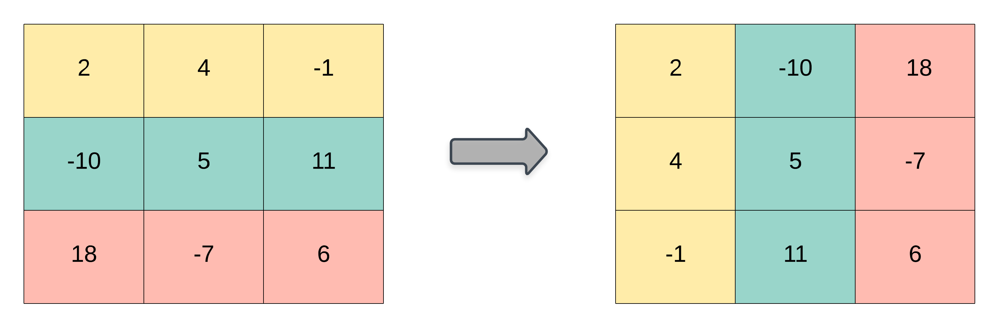

# [LeetCode][leetcode] task # 867: [Transpose Matrix][task]

Description
-----------

> Given a 2D integer array `matrix`, return _the **transpose** of `matrix`_.
> 
> The **transpose** of a matrix is the matrix flipped over its main diagonal, switching the matrix's row and column indices.

 Example
-------




```sh
Input: matrix = [[1,2,3],[4,5,6],[7,8,9]]
Output: [[1,4,7],[2,5,8],[3,6,9]]
```

Solution
--------

| Task | Solution                     |
|:----:|:-----------------------------|
| 867  | [Transpose Matrix][solution] |


[leetcode]: <http://leetcode.com/>
[task]: <https://leetcode.com/problems/transpose-matrix/>
[solution]: <https://github.com/wellaxis/praxis-leetcode/blob/main/src/main/java/com/witalis/praxis/leetcode/task/h9/p867/option/Practice.java>
