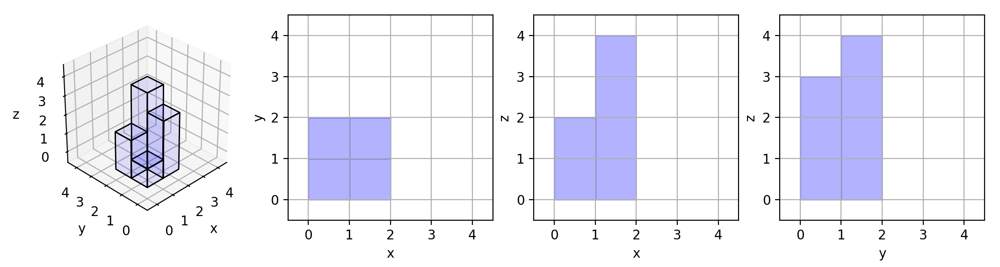

# [LeetCode][leetcode] task # 883: [Projection Area of 3D Shapes][task]

Description
-----------

> You are given an `n x n` `grid` where we place some `1 x 1 x 1` cubes that are axis-aligned with the `x`, `y`, and `z` axes.
> 
> Each value `v = grid[i][j]` represents a tower of `v` cubes placed on top of the cell `(i, j)`.
> 
> We view the projection of these cubes onto the `xy`, `yz`, and `zx` planes.
> 
> A **projection** is like a shadow, that maps our **3-dimensional** figure to a **2-dimensional** plane.
> We are viewing the "shadow" when looking at the cubes from the top, the front, and the side.
> 
> Return _the total area of all three projections_.

 Example
-------



```sh
Input: grid = [[1,2],[3,4]]
Output: 17
Explanation: Here are the three projections ("shadows") of the shape made with each axis-aligned plane.
```

Solution
--------

| Task | Solution                                 |
|:----:|:-----------------------------------------|
| 883  | [Projection Area of 3D Shapes][solution] |


[leetcode]: <http://leetcode.com/>
[task]: <https://leetcode.com/problems/projection-area-of-3d-shapes/>
[solution]: <https://github.com/wellaxis/praxis-leetcode/blob/main/src/main/java/com/witalis/praxis/leetcode/task/h9/p883/option/Practice.java>
