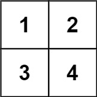

# [LeetCode][leetcode] task # 892: [Surface Area of 3D Shapes][task]

Description
-----------

> You are given an `n x n` `grid` where you have placed some `1 x 1 x 1` cubes.
> Each value `v = grid[i][j]` represents a tower of `v` cubes placed on top of cell `(i, j)`.
> 
> After placing these cubes, you have decided to glue any directly adjacent cubes to each other,
> forming several irregular 3D shapes.
> 
> Return _the total surface area of the resulting shapes_.
> 
> Note: The bottom face of each shape counts toward its surface area.

 Example
-------



```sh
Input: grid = [[1,2],[3,4]]
Output: 34
```

Solution
--------

| Task | Solution                              |
|:----:|:--------------------------------------|
| 892  | [Surface Area of 3D Shapes][solution] |


[leetcode]: <http://leetcode.com/>
[task]: <https://leetcode.com/problems/surface-area-of-3d-shapes/>
[solution]: <https://github.com/wellaxis/praxis-leetcode/blob/main/src/main/java/com/witalis/praxis/leetcode/task/h9/p892/option/Practice.java>
