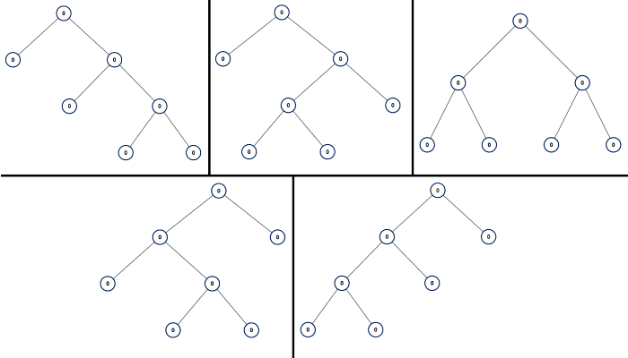

# [LeetCode][leetcode] task # 894: [All Possible Full Binary Trees][task]

Description
-----------

> Given an integer `n`, return _a list of all possible **full binary trees** with `n` nodes_.
> Each node of each tree in the answer must have `Node.val == 0`.
> 
> Each element of the answer is the root node of one possible tree.
> You may return the final list of trees in **any order**.
> 
> A **full binary tree** is a binary tree where each node has exactly `0` or `2` children.

 Example
-------



```sh
Input: n = 7
Output: [[0,0,0,null,null,0,0,null,null,0,0],[0,0,0,null,null,0,0,0,0],[0,0,0,0,0,0,0],[0,0,0,0,0,null,null,null,null,0,0],[0,0,0,0,0,null,null,0,0]]
```

Solution
--------

| Task | Solution                                   |
|:----:|:-------------------------------------------|
| 894  | [All Possible Full Binary Trees][solution] |


[leetcode]: <http://leetcode.com/>
[task]: <https://leetcode.com/problems/all-possible-full-binary-trees/>
[solution]: <https://github.com/wellaxis/praxis-leetcode/blob/main/src/main/java/com/witalis/praxis/leetcode/task/h9/p894/option/Practice.java>
