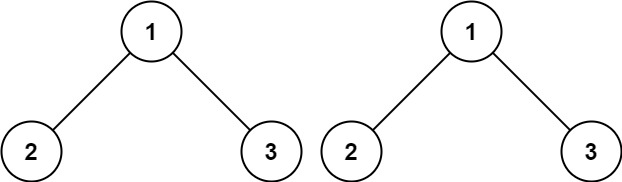

# [LeetCode][leetcode] task # 100: [Same Tree][task]

Description
-----------

> Given the roots of two binary trees `p` and `q`,
> write a function to check if they are the same or not.
>
> Two binary trees are considered the same if
> they are structurally identical, and the nodes have the same value.

 Example
-------



```sh
Input: p = [1,2,3], q = [1,2,3]
Output: true
```

Solution
--------

| Task | Solution              |
|:----:|:----------------------|
| 100  | [Same Tree][solution] |


[leetcode]: <http://leetcode.com/>
[task]: <https://leetcode.com/problems/same-tree/>
[solution]: <https://github.com/wellaxis/witalis-jkit/blob/main/module/tasks/src/main/java/com/witalis/jkit/tasks/core/task/leetcode/p100/option/Practice.java>
