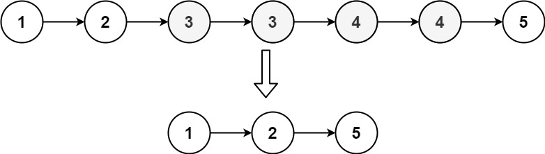

# [LeetCode][leetcode] task # 82: [Remove Duplicates from Sorted List II][task]

Description
-----------

> Given the `head` of a sorted linked list,
> _delete all nodes that have duplicate numbers,
> leaving only distinct numbers from the original list_.
> Return _the linked list_ **sorted** _as well_.

Example
-------



```sh
Input: head = [1,2,3,3,4,4,5]
Output: [1,2,5]
```

Solution
--------

| Task | Solution                                          |
|:----:|:--------------------------------------------------|
|  82  | [Remove Duplicates from Sorted List II][solution] |


[leetcode]: <http://leetcode.com/>
[task]: <https://leetcode.com/problems/remove-duplicates-from-sorted-list-ii/>
[solution]: <https://github.com/wellaxis/witalis-jkit/blob/main/module/tasks/src/main/java/com/witalis/jkit/tasks/core/task/leetcode/p82/option/Practice.java>
