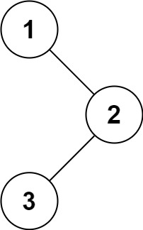

# [LeetCode][leetcode] task # 94: [Binary Tree Inorder Traversal][task]

Description
-----------

> Given the root of a binary tree,
> return the _inorder traversal of its nodes' values_.

 Example
-------



```sh
Input: root = [1,null,2,3]
Output: [1,3,2]
```

Solution
--------

| Task | Solution |
| :------: | :------ |
| 94 | [Binary Tree Inorder Traversal][solution] |


[leetcode]: <http://leetcode.com/>
[task]: <https://leetcode.com/problems/binary-tree-inorder-traversal/>
[solution]: <https://github.com/wellaxis/witalis-jkit/blob/main/module/tasks/src/main/java/com/witalis/jkit/tasks/core/task/leetcode/p94/option/Practice.java>
